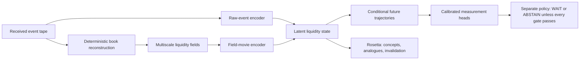

# William Keenan

I build tools for people who work alongside AI agents: ways to see what agents are doing, coordinate them, and keep a record they can't quietly rewrite. By day I work at the intersection of AI and banking.

This is a personal page. The projects and views here are my own and don't represent my employer.

[KE Studios](https://kestudios.dev) · [Agent Rooms](https://agentrooms.io) · [Hugging Face](https://huggingface.co/willykeenan)

<table>
<tr><td width="33%" align="center"> <b>KE Activity Monitor</b></td><td width="33%" align="center"> <b>Switchboard</b></td><td width="33%" align="center"> <b>AgentBrain Handoffs</b></td></tr>
<tr><td width="33%" align="center"> <b>Tanpin</b></td><td width="33%" align="center"> <b>ContextLib</b></td><td width="33%" align="center"> <b>Live Wire</b></td></tr>
<tr><td width="33%" align="center"> <b>Strand DNA</b></td><td width="33%" align="center"> <b>DayLedger</b></td><td width="33%" align="center"> <b>KE Pen</b></td></tr>
</table>

Real screenshots of each project's demo.

## Agent infrastructure

Tools for running several AI coding agents (Claude Code, Codex and others) as a team, locally and in the open.

| Project | What it does | Try it |
| --- | --- | --- |
| [Switchboard](https://github.com/willykeenan/switchboard) | A board for AI agents: rooms, a map of which agents may message which, a task board and exact-recipient handoffs. You decide who talks to whom. | Hosted version coming to [agentrooms.io](https://agentrooms.io) |
| [AgentBrain Handoffs](https://github.com/willykeenan/agentbrain-handoffs) | Delivers work into an agent's existing session exactly once: never to a substitute, never twice, never mid-turn. CLI, live status page, MCP server. | [Live demo](https://huggingface.co/spaces/willykeenan/agentbrain-handoffs) |
| [ContextLib](https://github.com/willykeenan/agentbrain-contextlib) | A project's long-term memory as plain Markdown you can read in Finder: decisions, facts and lessons, append-only, with a tamper-evident log. | [Sample library](https://huggingface.co/spaces/willykeenan/contextlib) |
| [KE Activity Monitor](https://github.com/willykeenan/ke-activity-monitor) | A Mac activity monitor for people who run agents: which processes are AI runtimes, GPU compute, worker pools, projects and knowledge brains. | [Product page](https://huggingface.co/spaces/willykeenan/activity-monitor) |
| [CPU and GPU Workers](https://github.com/willykeenan/cpu-gpu-workers) | Read-only views of local CPU job pools and the Apple GPU, inside Claude Code and Codex. | |
| [KE Pen](https://github.com/willykeenan/pen) | Draw on your screen; your AI assistant gets exactly what you pointed at. Free, for macOS, Windows and Linux. | [Download](https://github.com/willykeenan/pen/releases) |
| [DayLedger](https://github.com/willykeenan/dayledger) | Turns Claude Code session logs into a daily work report that follows tasks across days. | [Sample report](https://huggingface.co/spaces/willykeenan/dayledger) |
| [Codex Lens](https://github.com/willykeenan/codex-lens) | A read-only viewer for local OpenAI Codex threads. Not affiliated with OpenAI. | |

## Products and experiments

| Project | What it does | Try it |
| --- | --- | --- |
| [KE Credits](https://github.com/willykeenan/ke-credits) | A prepaid-credits ledger for AI products in your own Postgres, with Stripe, refunds and disputes handled in any order. | |
| [MacroMail](https://github.com/willykeenan/macromail.dev) | Free, open-source email for AI agents that you run yourself: mailboxes, a REST API and an MCP server. | |
| [Tanpin](https://github.com/willykeenan/tanpin) | Item-by-item inventory that reorders itself: per-SKU forecasts, automatic purchase orders and delivery ETAs. | [Demo](https://huggingface.co/spaces/willykeenan/tanpin) |
| [Live Wire](https://github.com/willykeenan/live-wire) | A 24/7 satirical AI news channel with cartoon anchors and mouth sync. Satire is always labelled. | [livewire.show](https://livewire.show) |
| [Strand DNA](https://github.com/willykeenan/strand-dna) | A DNA report that runs entirely in your browser; your raw file never leaves the device. | [Try the sample](https://huggingface.co/spaces/willykeenan/strand-dna) |
| [Pointer](https://github.com/willykeenan/pointer-app) | Press one key, ask out loud, and get a plain-language answer about whatever is under your cursor. | |

## Research

### [Waggle + Kea](https://github.com/willykeenan/waggle-kea)

A protocol for compact, typed coordination between machine agents (Waggle) and a separate decoder and audit layer that never grants authority to act (Kea). Tested on the public BANKING77 benchmark with frozen gates, and I publish the negative results alongside the positive ones.

Details and results

Waggle is an experimental protocol for compact, typed coordination between
machine agents. Kea is its separate decoder and audit layer: it registers codec
manifests, checks payload integrity, reconstructs deterministic messages,
surfaces uncertainty, records hash-chained history, and never grants authority
to act.

The public TypeScript reference implementation includes:

- canonical encoding and content-addressed identity;
- closed-world packet and envelope schemas, causal-parent integrity, global
  idempotency collision detection, and guarded atomic ledger batches;
- typed HTTP failure behavior, read-only defaults, deterministic replay, and
  explicit `not-evaluated` policy semantics;
- a public BANKING77 intent-classification benchmark with matched models, five
  fixed seeds, paired uncertainty, calibration, risk–coverage, leakage and
  typo-stress controls, and all 77 per-intent results;
- Node 22/24 CI, coverage gates, CodeQL, dependency auditing, clean-package
  smoke tests, and a separate full benchmark-reproduction workflow.

In the exploratory BANKING77 evaluation, word-plus-character features improved
macro-F1 from `0.8915` to `0.9119` over the matched word-only model. The paired
difference was `+0.0203` with a 2,000-draw 95% bootstrap interval of
`[+0.0140, +0.0274]`. All 3,050 train-disjoint predictions preserved their
route through direct, JSON, and Waggle/Kea handoffs; the finite fault suite had
zero detectable-fault accepts and Kea granted zero authority. The repository
contains the pinned source contract, code, text-free predictions, complete
metrics, checksums, and one-command reproduction.

A bounded local study reused one Qwen3-14B native prefix state across six
source-separated branches on Apple Metal. It preserved exact outputs and beat
repeated full-text reconstruction after branch two, but it did **not** beat the
stronger cached-prefix or warmed fresh-native controls. I rejected the broader
efficiency claim and published the negative result with the code.

### [Financial Complaint Intelligence](https://github.com/willykeenan/financial-complaint-intelligence)

An end-to-end NLP evaluation on public CFPB complaint data: temporal holdouts, deduplication, TF-IDF versus DistilBERT, calibration, risk–coverage analysis and human-review routing. The locked experiment favored the simpler baseline.

### HEATWAKE (private research)

Can a model learn how market liquidity evolves from raw order-book events, the way a language model learns from text? HEATWAKE is my research system for testing that under frozen, time-ordered evaluation with strict abstention rules. No model family has cleared its preregistered gates yet, so none has been selected. It is research, not a trading system.

How it works and how I test it

Everyone has heard of a **large language model (LLM)**: a system designed to
learn structure from sequences of language. HEATWAKE asks an analogous but
domain-specific question: can a machine learn the evolving structure of market
liquidity from native order-book events and causal, multiscale “movies” of the
book?

I call the experimental model family a **Liquidity Cognition Model (LCM)**.
HEATWAKE is the complete research system—recorder, representation, model,
evaluation, observability, and refusal policy—while the LCM is the predictive
model inside it. Here `LCM` means *Liquidity Cognition Model*, not the unrelated
“Large Concept Model” term used elsewhere in machine learning. The comparison
is about sequence modeling—not an assertion that the systems share scale,
architecture, or validated capability.

| Design analogy | Language model | HEATWAKE LCM |
| --- | --- | --- |
| Causal input | Ordered text tokens | Timestamped adds, changes, cancels, trades, and deterministic liquidity fields |
| Learned state | Latent linguistic context | Latent state over evolving liquidity structures and conditional futures |
| Predictive object | Distribution over subsequent tokens | Distribution over future fields, structure lifecycles, price paths, barriers, excursions, and settlement outcomes |
| Human-readable layer | Generated language | Calibrated measurements plus a separately tested decoder for concepts, analogues, uncertainty, and invalidation |
| Operational boundary | Application-dependent | Read-only decision support; model output never grants authority to trade |

#### The core idea

A normal liquidity heatmap shows **where displayed size appeared**. It does not
tell us what that structure is doing. The same bright wall may hold, withdraw
before contact, absorb aggressive flow while replenishing, break, or reform.
HEATWAKE treats those as competing conditional futures rather than assigning
one visual pattern a fixed meaning.

The system therefore preserves two synchronized causal views:

- the **native event tape**—adds, modifications, cancellations, executions,
  timing, feed health, and reconstruction state;
- a **deterministic semantic field**—time × relative price × side × channel at
  multiple horizons, derived from exactly the events available at the decision
  cutoff rather than from screenshots.

Every field value remains traceable to its source event and render contract.
An event encoder and a field-movie encoder meet at the same cutoff and produce
a latent distribution over several plausible future liquidity trajectories.
The model is not asked to generate one attractive future image and call it a
forecast.

```mermaid
flowchart LR
    A[Received event tape] --> B[Deterministic book reconstruction]
    B --> C[Multiscale liquidity fields]
    A --> D[Raw-event encoder]
    C --> E[Field-movie encoder]
    D --> F[Latent liquidity state]
    E --> F
    F --> G[Conditional future trajectories]
    F --> H[Rosetta: concepts, analogues, invalidation]
    G --> I[Calibrated measurement heads]
    I --> J[Separate policy: WAIT or ABSTAIN unless every gate passes]
```

The phrase **Liquidity Wavefunction** is a classical probability metaphor for
that unresolved distribution of possible future states—not a quantum-computing
or market-physics claim. A separately tested “Rosetta” layer translates the
latent state into inspectable concepts, similar historical scenes, sensitivity,
and reasons a forecast would be invalidated. It is an observability surface,
not the source of the prediction. Forecasting, explanation, and permission to
act remain three different layers.

#### How I test it

Hypotheses, baselines, metrics, compute limits, stopping rules, and failure
outcomes are frozen before evaluation. Partitions move forward in time with
purge and embargo boundaries; future-prefix, shuffled-label, time-reversal,
target-lag, modality-ablation, lineage, and impossible-performance controls
fail closed. Probabilistic loss, calibration, grouped uncertainty, feed health,
out-of-distribution state, and realistic costs must all clear their own gates.
Otherwise the system selects no model and abstains.

The bounded causal visual, event, and fused families tested so far did **not**
clear their frozen selection gates. I selected no model, did not retune the
failed families after seeing their results, and kept later evaluation gates
sealed. That is the current result—not market edge, profitability, trading
readiness, production deployment, or live operational use.

## How I work

- Define the claim and falsifier before choosing a model.
- Protect temporal causality and data lineage before measuring performance.
- Compare strong, equally informed baselines—not decorative controls.
- Calibrate uncertainty and route low-confidence cases to human review.
- Keep model output separate from operational authority.
- Publish negative results when the evidence does not clear the frozen gate.
