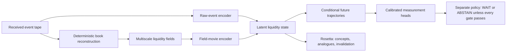

# William Keenan

I build evidence-first machine-learning and AI systems: chronological evaluation,
calibrated uncertainty, auditable agent coordination, and decision support that
keeps people in control.

## Research and machine learning

### [Waggle + Kea](https://github.com/willykeenan/waggle-kea) — open source

Waggle is an experimental protocol for compact, typed coordination between
machine agents. Kea is its separate decoder and audit layer: it registers codec
manifests, checks payload integrity, reconstructs deterministic messages,
surfaces uncertainty, records hash-chained history, and never grants authority
to act.

The public TypeScript reference implementation includes:

- canonical encoding and content-addressed identity;
- closed-world packet and envelope schemas, causal-parent integrity, global
  idempotency collision detection, and guarded atomic ledger batches;
- typed HTTP failure behavior, read-only defaults, deterministic replay, and
  explicit `not-evaluated` policy semantics;
- a public BANKING77 intent-classification benchmark with matched models, five
  fixed seeds, paired uncertainty, calibration, risk–coverage, leakage and
  typo-stress controls, and all 77 per-intent results;
- Node 22/24 CI, coverage gates, CodeQL, dependency auditing, clean-package
  smoke tests, and a separate full benchmark-reproduction workflow.

In the exploratory BANKING77 evaluation, word-plus-character features improved
macro-F1 from `0.8915` to `0.9119` over the matched word-only model. The paired
difference was `+0.0203` with a 2,000-draw 95% bootstrap interval of
`[+0.0140, +0.0274]`. All 3,050 train-disjoint predictions preserved their
route through direct, JSON, and Waggle/Kea handoffs; the finite fault suite had
zero detectable-fault accepts and Kea granted zero authority. The repository
contains the pinned source contract, code, text-free predictions, complete
metrics, checksums, and one-command reproduction.

A bounded local study reused one Qwen3-14B native prefix state across six
source-separated branches on Apple Metal. It preserved exact outputs and beat
repeated full-text reconstruction after branch two, but it did **not** beat the
stronger cached-prefix or warmed fresh-native controls. I rejected the broader
efficiency claim and published the negative result with the code.

### [Financial Complaint Intelligence](https://github.com/willykeenan/financial-complaint-intelligence)

An end-to-end NLP evaluation on public CFPB complaint data, covering temporal
holdouts, deduplication, TF-IDF versus DistilBERT, confidence calibration,
risk–coverage analysis, error analysis, and human-review routing. The locked
experiment favored the simpler baseline—disciplined model selection over model
hype.

### HEATWAKE — private ML research: a Liquidity Cognition Model

Everyone has heard of a **large language model (LLM)**: a system designed to
learn structure from sequences of language. HEATWAKE asks an analogous but
domain-specific question: can a machine learn the evolving structure of market
liquidity from native order-book events and causal, multiscale “movies” of the
book?

I call the experimental model family a **Liquidity Cognition Model (LCM)**.
HEATWAKE is the complete research system—recorder, representation, model,
evaluation, observability, and refusal policy—while the LCM is the predictive
model inside it. Here `LCM` means *Liquidity Cognition Model*, not the unrelated
“Large Concept Model” term used elsewhere in machine learning. The comparison
is about sequence modeling—not an assertion that the systems share scale,
architecture, or validated capability.

| Design analogy | Language model | HEATWAKE LCM |
| --- | --- | --- |
| Causal input | Ordered text tokens | Timestamped adds, changes, cancels, trades, and deterministic liquidity fields |
| Learned state | Latent linguistic context | Latent state over evolving liquidity structures and conditional futures |
| Predictive object | Distribution over subsequent tokens | Distribution over future fields, structure lifecycles, price paths, barriers, excursions, and settlement outcomes |
| Human-readable layer | Generated language | Calibrated measurements plus a separately tested decoder for concepts, analogues, uncertainty, and invalidation |
| Operational boundary | Application-dependent | Read-only decision support; model output never grants authority to trade |

#### The core idea

A normal liquidity heatmap shows **where displayed size appeared**. It does not
tell us what that structure is doing. The same bright wall may hold, withdraw
before contact, absorb aggressive flow while replenishing, break, or reform.
HEATWAKE treats those as competing conditional futures rather than assigning
one visual pattern a fixed meaning.

The system therefore preserves two synchronized causal views:

- the **native event tape**—adds, modifications, cancellations, executions,
  timing, feed health, and reconstruction state;
- a **deterministic semantic field**—time × relative price × side × channel at
  multiple horizons, derived from exactly the events available at the decision
  cutoff rather than from screenshots.

Every field value remains traceable to its source event and render contract.
An event encoder and a field-movie encoder meet at the same cutoff and produce
a latent distribution over several plausible future liquidity trajectories.
The model is not asked to generate one attractive future image and call it a
forecast.

```mermaid
flowchart LR
    A[Received event tape] --> B[Deterministic book reconstruction]
    B --> C[Multiscale liquidity fields]
    A --> D[Raw-event encoder]
    C --> E[Field-movie encoder]
    D --> F[Latent liquidity state]
    E --> F
    F --> G[Conditional future trajectories]
    F --> H[Rosetta: concepts, analogues, invalidation]
    G --> I[Calibrated measurement heads]
    I --> J[Separate policy: WAIT or ABSTAIN unless every gate passes]
```

The phrase **Liquidity Wavefunction** is a classical probability metaphor for
that unresolved distribution of possible future states—not a quantum-computing
or market-physics claim. A separately tested “Rosetta” layer translates the
latent state into inspectable concepts, similar historical scenes, sensitivity,
and reasons a forecast would be invalidated. It is an observability surface,
not the source of the prediction. Forecasting, explanation, and permission to
act remain three different layers.

#### How I test it

Hypotheses, baselines, metrics, compute limits, stopping rules, and failure
outcomes are frozen before evaluation. Partitions move forward in time with
purge and embargo boundaries; future-prefix, shuffled-label, time-reversal,
target-lag, modality-ablation, lineage, and impossible-performance controls
fail closed. Probabilistic loss, calibration, grouped uncertainty, feed health,
out-of-distribution state, and realistic costs must all clear their own gates.
Otherwise the system selects no model and abstains.

The bounded causal visual, event, and fused families tested so far did **not**
clear their frozen selection gates. I selected no model, did not retune the
failed families after seeing their results, and kept later evaluation gates
sealed. That is the current result—not market edge, profitability, trading
readiness, production deployment, or live operational use.

## Open-source developer tools

<table>
<tr><td width="33%" align="center"> <b>KE Activity Monitor</b></td><td width="33%" align="center"> <b>Switchboard</b></td><td width="33%" align="center"> <b>AgentBrain Handoffs</b></td></tr>
<tr><td width="33%" align="center"> <b>Tanpin</b></td><td width="33%" align="center"> <b>ContextLib</b></td><td width="33%" align="center"> <b>Live Wire</b></td></tr>
<tr><td width="33%" align="center"> <b>Strand DNA</b></td><td width="33%" align="center"> <b>DayLedger</b></td><td width="33%" align="center"> <b>KE Pen</b></td></tr>
</table>

Real screenshots of each project's demo.

### [KE Activity Monitor](https://github.com/willykeenan/ke-activity-monitor)

A Mac activity monitor for people who run AI agents. It has the usual CPU, memory,
energy, disk and network views, plus which processes are AI runtimes, GPU compute,
worker pools with real progress, Codex and Claude Code projects, and local knowledge
brains. Local only, with 615 tests.
[Product page](https://huggingface.co/spaces/willykeenan/activity-monitor).

### [AgentBrain Handoffs](https://github.com/willykeenan/agentbrain-handoffs)

Durable delivery of work between AI coding agents (Claude Code, Codex, or any
command). Each handoff becomes exactly one new turn in the recipient's existing
session: it is never delivered to a substitute agent, never sent twice, and never
interrupts an agent that is mid-turn. Failed deliveries are resent within a fixed
bound; unknown outcomes are reconciled by observation rather than retried. It ships
with a CLI, a live status page, and an MCP server; Python standard library only.

### [ContextLib](https://github.com/willykeenan/agentbrain-contextlib)

A project's long-term memory as plain Markdown files: decisions, requirements, facts,
lessons and returns that you can read in Finder, carry on an SSD, and diff in git.
Records are append-only with a tamper-evident ledger, secrets and home paths are
refused, and an always-loaded brief stays under 8 KB. It ships a CLI and an MCP
server, and plugs into AgentBrain Handoffs; Python standard library only.
[Live sample library](https://huggingface.co/spaces/willykeenan/contextlib).

### [Tanpin](https://github.com/willykeenan/tanpin)

Item-by-item inventory that reorders itself, after the *tanpin kanri* method:
per-SKU demand forecasts with rolling-origin backtests, automatic purchase orders,
supplier email, delivery ETAs, and signed Stripe, Shopify, and Square sales
sources. REST API, MCP server, and dashboard; zero runtime dependencies; tested
across time zones.

### [Switchboard](https://github.com/willykeenan/switchboard)

A local switchboard for AI coding agents: rooms, a directed-permission map of which
agents may message which, placements, exact-recipient handoffs, and a task board.
The operator decides who may talk to whom; agents never launch or wake each other
without that permission. AgentBrain Handoffs is its delivery layer, released on
its own.

### [KE Credits](https://github.com/willykeenan/ke-credits)

A prepaid-credits ledger for AI products that runs in your own Postgres. Spends
happen inside the same transaction as the work, so a balance cannot go negative
under concurrency. It is append-only and idempotent, and it ships a Stripe Checkout
and webhook adapter that defaults to test mode. Refunds and disputes are safe in any
delivery order. Zero runtime dependencies; experimental 0.x.

### [KE Pen](https://github.com/willykeenan/pen)

A free visual pointing layer for MCP-capable AI assistants on macOS, Windows, and
Linux: draw on the screen, and the assistant receives exactly what you pointed at.

### Smaller tools

- [codex-lens](https://github.com/willykeenan/codex-lens): read-only viewer for local
  OpenAI Codex threads, plus a Claude skill (independent; not affiliated with OpenAI).
- [DayLedger](https://github.com/willykeenan/dayledger): turns Claude Code session logs
  into a daily work report that tracks tasks across days.
- [CPU and GPU Workers](https://github.com/willykeenan/cpu-gpu-workers): read-only views
  of local CPU jobs and the Apple GPU that open inside Claude Code and Codex.

## Other open projects

- [Strand DNA](https://github.com/willykeenan/strand-dna): a DNA report that runs
  entirely in the browser; the raw 23andMe or AncestryDNA file never leaves the device.
  Openly licensed sources only, with plain-language limits on what the results mean.
- [Live Wire](https://github.com/willykeenan/live-wire): a 24/7 satirical AI news
  channel with cartoon anchors and mouth sync. It ships a keyless demo, invented names,
  and a content policy that requires satire to be labelled.

## Applied system

### [Pointer](https://github.com/willykeenan/pointer-app)

A Mac desktop-assistance prototype combining screen context and voice input to
provide low-friction, plain-language guidance. It reflects the same design
priority as my ML work: make complex systems legible and preserve human review.

## How I work

- Define the claim and falsifier before choosing a model.
- Protect temporal causality and data lineage before measuring performance.
- Compare strong, equally informed baselines—not decorative controls.
- Calibrate uncertainty and route low-confidence cases to human review.
- Keep model output separate from operational authority.
- Publish negative results when the evidence does not clear the frozen gate.
