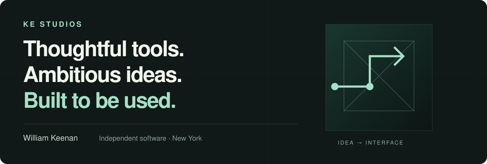
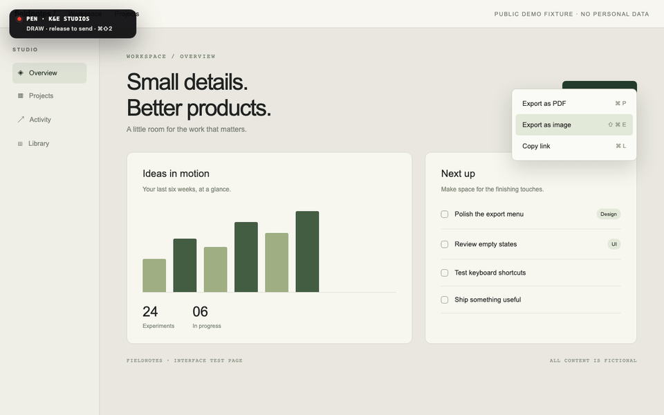
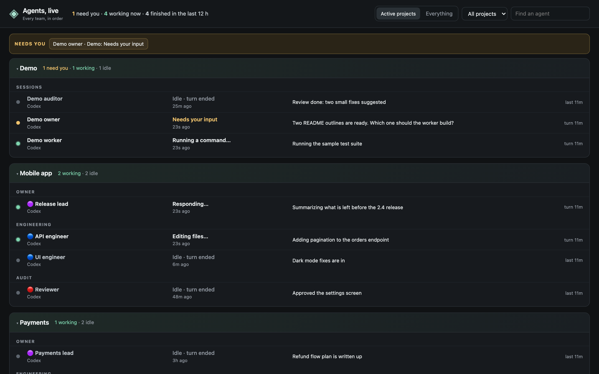
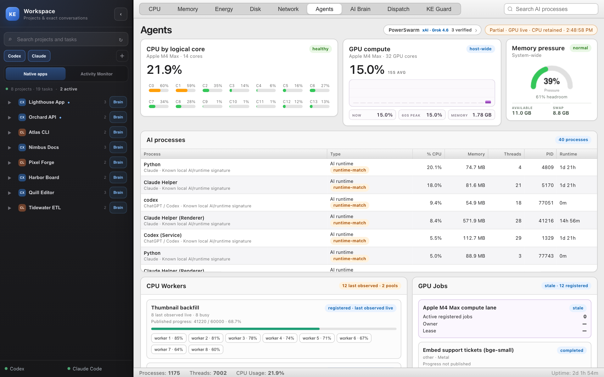
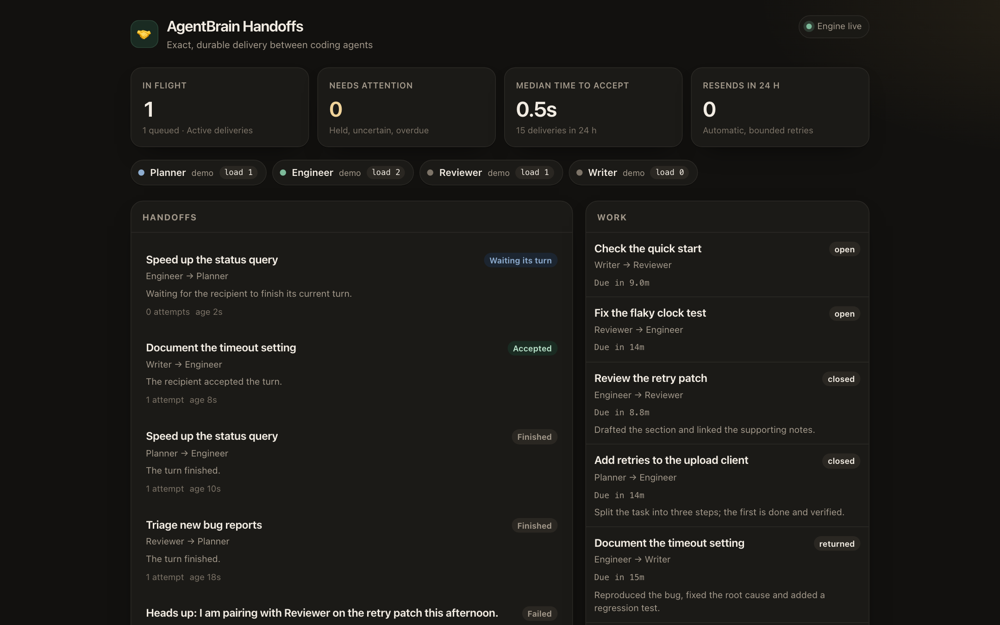
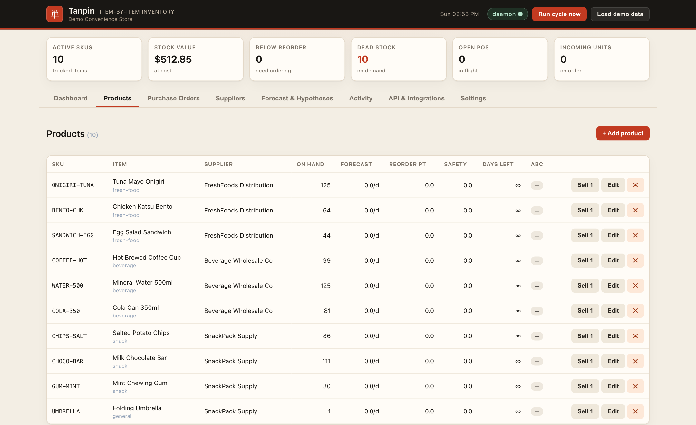

<a href="https://kestudios.dev"><picture><source media="(max-width: 600px)" srcset="assets/header-mobile.svg"></picture></a>

I'm **William**, a developer in New York. I work in banking and build independent software through **KE Studios**. I care about the details that make a tool useful: seeing what an agent is doing, pointing at exactly what you mean, and picking up where you left off.

**[Explore KE Studios ↗](https://kestudios.dev)** &nbsp; · &nbsp; [Agent Rooms](https://agentrooms.io) &nbsp; · &nbsp; [Hugging Face](https://huggingface.co/willykeenan) &nbsp; · &nbsp; [Get in touch](mailto:william@kestudios.dev)

## Selected work

### KE Pen · Show what you mean

Circle a detail on your screen and give your AI assistant the visual context. A small tool for the moments when pointing is easier than explaining.

<a href="https://github.com/willykeenan/pen"><picture><source media="(prefers-reduced-motion: reduce)" srcset="assets/pen-point.png"></picture></a>

**[Download for Mac, Windows & Linux ↗](https://github.com/willykeenan/pen/releases/latest)** &nbsp; · &nbsp; [Source](https://github.com/willykeenan/pen)

Actual KE Pen drawing interface over a fictional sample page. Its desktop bridge is a test fixture; no AI response is shown.

### Switchboard · A place for every agent

See who is working, who needs you, and what just finished. Organize your agents, keep their work visible, and choose which sessions may talk to each other.

**[Run it locally ↗](https://github.com/willykeenan/switchboard#60-second-quickstart)** &nbsp; · &nbsp; [Source](https://github.com/willykeenan/switchboard) &nbsp; · &nbsp; [Agent Rooms](https://agentrooms.io)

Fresh capture of the public Live interface, using invented agents and isolated sample sessions.

### KE Activity Monitor · Know what your Mac is doing

CPU, memory, disk, network—and the agents behind the processes. See local worker progress, GPU activity, and project conversations in one place.

**[Explore the app ↗](https://huggingface.co/spaces/willykeenan/activity-monitor)** &nbsp; · &nbsp; [Source & setup](https://github.com/willykeenan/ke-activity-monitor)

Current public app interface rendered with its published, sanitized screenshot fixture. This is sample telemetry, not a live feed.

### AgentBrain Handoffs · Keep the work moving

Send work to one exact agent session, wait when it's busy, and track the result. A local delivery layer with a CLI, MCP server, and an inspectable status page.

**[Try the demo ↗](https://huggingface.co/spaces/willykeenan/agentbrain-handoffs)** &nbsp; · &nbsp; [Source & quickstart](https://github.com/willykeenan/agentbrain-handoffs)

Fresh capture of the real demo. Its agents, work, and delivery measurements are simulated.

### Tanpin · The small details of running a store

Item-by-item inventory with demand forecasts, purchase orders, and delivery estimates. Built for people and agents, with a dashboard, REST API, and MCP server.

**[Source & quickstart ↗](https://github.com/willykeenan/tanpin)** &nbsp; · &nbsp; [API guide](https://github.com/willykeenan/tanpin/blob/main/docs/API.md)

Current public source, running locally with its built-in sample store. No real orders or supplier messages.

## More from the studio

| Project | Built for |
| --- | --- |
| [ContextLib](https://github.com/willykeenan/agentbrain-contextlib) | Project notes, decisions, and lessons in traceable Markdown. |
| [PowerSwarm](https://github.com/willykeenan/powerswarm) | Parallel coding work in isolated branches, with tests before integration. |
| [CPU & GPU Workers](https://github.com/willykeenan/cpu-gpu-workers) | Local worker progress and Apple GPU activity from your coding assistant. |
| [MacroMail](https://github.com/willykeenan/macromail.dev) | Self-hosted email for agents, with an API and MCP server. |
| [Codex Lens](https://github.com/willykeenan/codex-lens) | Browsing local Codex conversations. Independent; not affiliated with OpenAI. |
| [DayLedger](https://github.com/willykeenan/dayledger) | Daily work reports from coding-session logs. |
| [KE Credits](https://github.com/willykeenan/ke-credits) | Prepaid credits, payments, refunds, and disputes in your own Postgres database. |
| [Live Wire](https://github.com/willykeenan/live-wire) | A satirical news channel with animated AI anchors. |
| [Strand DNA](https://github.com/willykeenan/strand-dna) | Exploring a DNA report locally in your browser. |
| [Landmark Prep](https://github.com/willykeenan/landmark-prep) | Real estate license exam prep for every state, with state facts quoted from official sources. |
| [KE Volume Mixer](https://github.com/willykeenan/volume-mixer) | Per-app volume, mute, and live meters from the macOS menu bar. |
| [Pointer](https://github.com/willykeenan/pointer-app) | Point at your screen and ask a question out loud. |

## Research

I publish experiments with reproduction steps and keep the negative results in.

**[Waggle + Kea](https://github.com/willykeenan/waggle-kea)** — structured agent messages and independent checking, with a reproducible BANKING77 benchmark. Neither grants permission to act.

**[Financial Complaint Intelligence](https://github.com/willykeenan/financial-complaint-intelligence)** — text classification on public CFPB complaints, with chronological evaluation, duplicate controls, and confidence analysis. The simpler baseline won the fixed experiment.

Private research: HEATWAKE

I'm investigating patterns in market liquidity using order-book events and visual representations. The models tested so far have not passed my evaluation criteria. I have not established a trading edge. HEATWAKE remains private.

---

Personal projects. My views are my own, not my employer's. Preview provenance: [how these images were made](assets/PROVENANCE.md).
